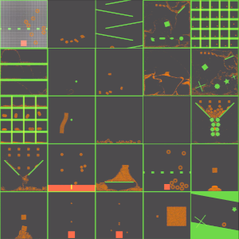

# soft2d-release
This is soft2d's official repository for the latest releases, user examples and documentation. The user documentation is hosted at [here](https://docs.soft2d.tech/).

## Introduction
Soft2D is a 2D multi-material continuum physics engine designed for real-time applications. With soft2d, users can simulate various deformable objects, such as fluids, sand, snow, and elastic bodies within their applications.

Soft2D is distributed as shared library binary files and header files. These files are under the `soft2d/` directory. Additionally, soft2d relies on [Taichi C-API](https://docs.taichi-lang.org/docs/taichi_core) library. The taichi c-api library is located at `dependencies/taichi_c_api/`, which has the same directory structure as `soft2d/`.

### Binary Compatibility
Here we list the ABI compatibility of soft2d binary files:
* Linux: x86-64 (Tested on Ubuntu 20.04 and Ubuntu 22.04)
* Windows: x86-64 (Tested on Windows 10 with Visual Studio 2022)
* macOS: arm64-m1 (Tested on Ventura)
* iOS: aarch64
* Android: arm64-v8a

## User Examples
 

Under the `examples/` directory, we provide a collection of user examples demonstrating the capabilities of soft2d. **These examples can run on Linux and Windows with Vulkan installed.** All examples have been tested on Ubuntu 20.04/22.04 and Windows 10 with Visual Studio 2022. Follow the steps below to build and run these examples.

### Project Cloning
* Use `git-lfs` to clone binary files correctly.
* Use `git submodule` to install the necessary third-party dependencies for the Vulkan renderer.

``` bash
# git clone ...
# cd soft2d-release/
git lfs pull
git submodule update --init --recursive
```
### Vulkan Installation
Please install Vulkan from [Vulkan Official Website](https://www.vulkan.org/), and make sure Vulkan-related environment variables are properly configured.

### Running the Examples

Linux and Windows users can use the following commands to build and run the examples:

#### Linux

* Clean the build directory: `./build_linux.sh --clean`
* Run the minimal test (No GUI): `./build_linux.sh --test`
* Run a specific example: `./build_linux.sh --example=<example_name>`
    * For instance: To run `examples/basic_shapes.cpp`, please use the command `./build_linux.sh --example=basic_shapes`
* Build all examples: `./build_linux.sh`
    * All output executables will be stored under the `build/` directory.

#### Windows
* Clean the build directory: `.\build_windows.bat --clean`
* Run the minimal test (No GUI): `.\build_windows.bat --test`
* Run a specific example: `.\build_windows.bat --example=<example_name>`
    * For instance: To run `examples/basic_shapes.cpp`, please use the command `.\build_windows.bat --example=basic_shapes`
* Build all examples: `.\build_windows.bat`
    * All output executables will be stored under the `build/Release/` directory.

